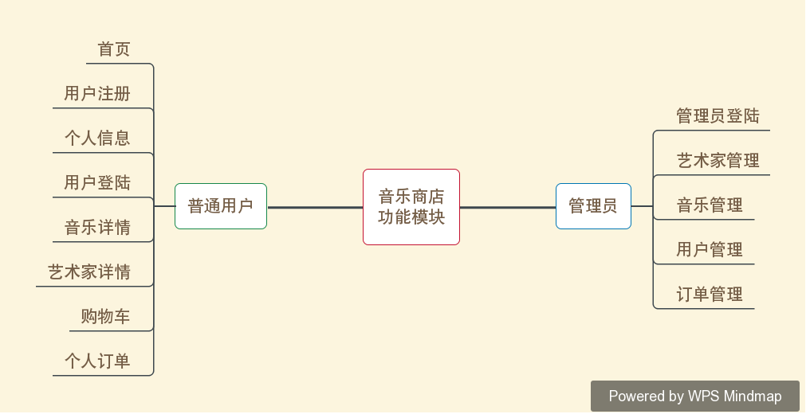

# Music Store(音乐商店) - JSP + Servlet + JDBC + MySQL版本

## 前言
Music Store是微软的一个开源项目，旨在通过一步步的教程帮助.NET学习者快速搭建一个ASP.NET MVC的项目。大学期间我通过学习，在2天内搭建了这个项目，作为模板供老师教学使用。现在已经毕业几年了，对软件开发有了新的认识，想以Music Store项目为蓝本，打造一个Java版本的Music Store。

## 项目计划
### 版本计划
* V1: Music Store(音乐商店) - JSP + Servlet + JDBC + MySQL版本
* V2: Music Store(音乐商店) - Spring + SpringMVC + MyBatis + MySQL版本
* V3: Music Store(音乐商店) - SpringBoot + MyBatis + MySQL版本
* V4: Music Store(音乐商店) - SpringCloud + MySQL版本

### 功能计划

## 项目计划
* Story #1: 管理员能够登陆后端系统
* Story #2: 管理员能够对艺术家进行增删改查
* Story #3: 管理员能够对音乐进行增删改查
* Story #4: 普通用户能够使用邮箱注册音乐商店
* Story #5: 普通用户能够登陆音乐商店
* Story #6: 普通用户登陆之后进入音乐商店首页，参考首页设计
* Story #7: 普通用户能够查看艺术家以及艺术家对应的音乐专辑
* Story #8: 普通用户能够查看音乐详情
* Story #9: 普通用户能够添加音乐到购物车
* Story #10: 普通用户对自己的送货地址进行管理
* Story #11: 普通用户可以选择购物车中的商品进行下单
* Story #12: 管理员能够对普通用户进行管理
* Story #13: 管理员能够对订单进行管理