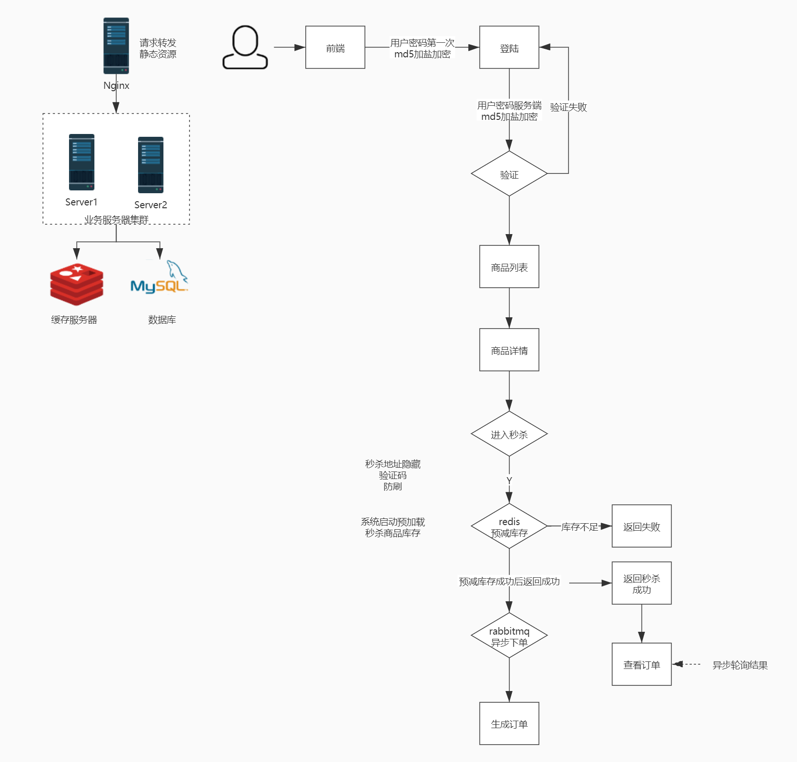

### 慕课网秒杀商城项目

系统访问地址： http://seckill.anythy.cn/

#### 项目架构图 && 业务流程图


#### 秒杀业务知识点汇总
> 业务特点
* 瞬间并发量大: 大量用户会在同一时间进行抢购，网站瞬时访问流量激增
* 库存少: 访问请求数量远远大于库存数量，只有少部分人能够秒杀成功
* 业务流程简单: 下订单减库存
> 技术特点
* 思想：尽量将请求拦截在上游，降低下游的压力
1. 如何控制秒杀商品页面购买按钮的定时点亮？[抢买问题]
    ```
    购买按钮只有在秒杀活动开始的时候才能点亮，在此之前是灰色的。如果该页面是动态生成的，当然可以在服务器端构造相应页面输出，控制该按钮是灰色还是点亮，但是为了减轻服务器端负载压力，更好地利用CDN、反向代理等性能优化手段，该页面被设计为静态页面，缓存在CDN、反向代理服务器上，甚至用户浏览器上。秒杀开始时，用户刷新页面，请求根本不会到达应用服务器。
    解决办法是使用JavaScript，在秒杀商品静态页面中加入一个JavaScript文件引用，该JavaScript文件中加入秒杀是否开始的标志和下单页面URL的随机参数（秒杀开始之前，标志为false，随机参数为空），当秒杀开始的时候生成一个新的JavaScript文件（秒杀开始之后，标志为true，随机参数为为服务端动态生成的随机参数）并被用户浏览器加载，控制秒杀商品页面的展示。这个JavaScript文件使用随机版本号，并且不被浏览器、CDN和反向代理服务器缓存。
    这个JavaScript文件非常小（主要放置秒杀开始后变更的2个动态参数），即使每次浏览器刷新都访问JavaScript文件服务器也不会对服务器集群和网络带宽造成太大压力。
    通俗的理解：秒杀前用户访问秒杀页面，页面被CDN缓存，但是会让一个js文件不会CDN缓存，这个js文件有什么用处呢？这个JS文件会渲染出下单的按钮，我们可以给下单按钮绑定一个onclick事件，传入一个参数，这个参数是秒杀开始时服务端生成并写入这个JS文件中的，所以秒杀前谁都不知道这个参数是多少。那这个onclick事件和传入的参数用来干什么呢？用来获取秒杀的地址，每个用户秒杀的地址我们让它都不一样，这个事件返回来一个string的pathvariable，这个pathvariable同时也会被存到服务端；客户端获取了秒杀地址后进行秒杀，这样每个用户的秒杀地址都不一样，可以保证不会被恶意脚本刷单。当然如果秒杀的时间很短，就没必要做获取秒杀地址这一步。
    ```
2. 如何防止超卖？
    ```
    从以下两点可以保证。第一使用redis预减库存，当系统启动或者秒杀开始前，我们可以将秒杀商品的库存数量放到redis中，由于redis是单线程运行，可以保证在减库存时是原子操作，这样就保证了线程的安全，不会出现库存数量乱跳的问题。当预减库存小于0时，直接返回库存数量不足。预减库存成功后，可以进行异步下单。第二是我们数据库级别减库存时sql语句加上where stock_count > 0的判断。
    ```
3. 如何防止重复下单？
    ```
    解决的思路有三点。第一点是在客户端，当用户第一次点击了秒杀按钮之后，客户端前置将按钮disable掉/或者立即跳转到另一个页面（秒杀结果页面），这样能减少客户端用户重复下单。第二点在服务端，当处理用户的秒杀请求时，服务端要判断用户是否已经下过单了，判断是否已经下单需要访问数据库，会照常大量的读访问。第三点在数据库端，我们可以设置(用户和商品ID)唯一索引来从数据库级别解决重复下单的问题。
    ```
4. 其他方面的优化思考
    ```
    排队下单：
    预测秒杀用户量非常庞大的时候，我们可以使用一个Queue接收前一部分请求让他们排队，后面的请求直接拒绝掉。比如商品数量有100个，有100万人进行秒杀，我们可以把前1万的请求塞进Queue，让请求一个个出Queue进行下单操作。这个设计需要前期对业务的观察和分析入Queue的数量，因为有的用户虽然进入了Queue，但是可能不会下单。
    接口限流防刷：
    可以设置对秒杀接口每个用户多少秒内访问多少次的设置，将userid+访问的url作为key/或者加上ip(可能不太合适，例如一群人在网吧抢单，这样照成误杀)存入redis中，设置过期时间，用户每访问一次就加一。也可以使用阿里的Sentinel中间件
    验证码削峰：
    用户进行秒杀时需要输入验证码，在用户输入验证码的过程中无形将瞬间的网络请求分散到10秒甚至更长时间，起到了一个削峰的作用。
    ```

> 注意事项
1. 秒杀系统独立部署：防止对现有网站业务造成冲击
2. 秒杀商品的页面静态化：缓解高并发下应用和数据库的负载压力
3. 租借秒杀活动带宽：防止带宽不足的问题
4. 秒杀URL地址隐藏：防止脚本刷单
#### 学习笔记

> 技术介绍
* 前端：Thymeleaf, Bootstrap, JQuery
* 后端：SpringBoot, JSR303(服务端验证框架，参数校验)，MyBatis
* 中间件：RabbitMQ(异步操作)，Redis, Druid(连接池，监控)

> 关键技术点
* 分布式会话
* 商品列表页：展示商品
* 商品详情页：秒杀的入口
* 订单详情页：秒杀成功进入商品详情页
* 压力测试：测试并发量
* 缓存优化：缓存静态页面，CDN，Nginx做网关
* 消息队列：异步下单
* 接口安全：防刷，限流，验证码，隐藏地址

> 学到了什么-目标
* 如何利用缓存
* 如何使用异步
* 如何编写优雅的代码

> 开发计划
* SpringBoot环境搭建
* 集成Thymeleaf，Result结果封装
* 集成MyBatis + Druid
* 集成Jedis + Redis安装 + 通用缓存Key封装
* 实现登录功能
* 数据库设计
* 明文密码两次MD5处理
* JSR303参数校验 + 全局异常处理器
* 分布式Session
* 功能实现： 数据库设计，商品列表页，商品详情页，订单详情页
* JMeter压测： 自定义变量模拟多用户，JMeter命令行使用
* 页面优化技术：页面缓存+URL缓存+对象缓存，页面静态化，前后端分离，静态资源优化，CDN优化
* 接口优化：Redis预减库存减少数据库访问，内存标记减少Redis访问，RabbitMQ队列缓冲，异步下单，增强用户体验
* Nginx水平扩展
* 再次压测
* 安全的优化：秒杀接口地址隐藏，数学公式验证码，接口防刷

> 零星笔记
* Result设计
{
    "code": 500100,
    "msg": 库存不足,
    "data": {}, []
}
* Redis集成和安装，bind的意义
* 如何避免Redis中的key冲突，加前缀
* 通用缓存Key封装：接口<-抽象类<-实现类
* incr, decr方法
* 登陆数据库设计
* 两次MD5：双重保险
  * 用户端：PASS=MD5(明文+固定salt) 防止明文密码在网络传输
  * 服务端：PASS=MD5(用户输入+随机salt) 防止数据库被盗，破解出密码
* JSR303参数校验
  * Field error in object 'loginVo' on field 'mobile': rejected value [21345678909]; codes [IsMobile.loginVo.mobile,IsMobile.mobile,IsMobile.java.lang.String,IsMobile]; arguments [org.springframework.context.support.DefaultMessageSourceResolvable: codes [loginVo.mobile,mobile]; arguments []; default message [mobile],true]; default message [手机号码格式错误]]
  * 全局异常处理
* 分布式session：将token写到cookie中，后续访问将携带这个token，服务端通过这个token在redis中获取用户信息，同时延长过期时间
  public String list(Model model, HttpServletResponse response,
                       @CookieValue(value = SeckillUserService.COOKIE_NAME_TOKEN, required = false) String coolieToken,
                       @RequestParam(value = SeckillUserService.COOKIE_NAME_TOKEN, required = false) String paramToken)
* 数据库设计
  * 商品表 订单表
  * 秒杀商品表（单独开出来一张表，不在商品表扩展，方便后期其他活动） 秒杀订单表
* 实际项目中价格不会是小数，存的都是分
* 商品详情页，秒杀页
* JMeter压测
* Redis压测工具redis-benchmark
  * redis-benchmark -h 127.0.0.1 -p 6379 -c 100 -n 100000 模拟100个并发发10万个请求
  * redis-benchmark -h 127.0.0.1 -p 63379 -q -d 100 模拟100个字节，默认是3个字节，返回的是1秒的并发量
  * redis-benchmark -t set, lpush -q -n 100000 只测试set和lpush，模拟一万个请求
  * redis-benchmark -n 100000 -q script load "redis.call('set', 'foo', 'bar')" 只测试redis的这个命令
* SpringBoot打war包
* 添加spring-boot-starter-tomcat的provided依赖
* 添加maven-war-plugin插件
* maven打包指定时间
* 页面优化技术
  * 页面缓存+URL缓存+对象缓存
      * 取缓存，手动渲染模板，输出结果
  * 页面静态化，前后端分离
  * 静态资源优化
  * CDN优化
* 超卖问题
  * 数据库级别解决：SQL加库存数量判断防止库存变成负数，数据库加唯一索引防止用户重复购买
  * 代码级别：判断是否已下单
  * 业务逻辑级别：加验证码
* 接口优化
  * Redis预减库存减少数据库访问
  * 内存标记减少Redids的访问
  * 请求先入队缓冲，异步下单，增强用户体验
  * RabbitMQ与SpringBoot集成
  * Nginx水平扩展
  * 扩展：阿里mycat分库分表原理
* 思路：减少数据库访问
  1. 系统初始化，把商品库存数量加载到Redis
  2. 收到请求，Redis预减库存，库存不足，直接返回，否则进入3
  3. 请求入队，立即返回派对中
  4. 请求出队，生成订单，减少库存
  5. 客户端轮询，判断是否秒杀成功
* SpringBoot集成MQ
  1. spring-boot-starter-amqp依赖
  2. 创建消息接收者
  3. 创建消息发送者
* RabbitMQ配置
  *  /etc/rabbitmq/rabbitmq.config
  [
  {rabbit, [{tcp_listeners, [5672]}, {loopback_users, ["guestuser", "guest"]}]}
  ].
  配置guest为management角色，注意是小写，guestuser为administrator角色，上面的配置可以远程通过web 15672端口访问管理界面
* Nginx横向扩展，配置tomcat集群
* LVS
* 安全优化
  * 秒杀接口地址隐藏
  * 数学公式验证码：防止机器人攻击，削峰（瞬间并发量分散到10秒甚至10几秒之内），分散用户请求
  * 接口限流防刷